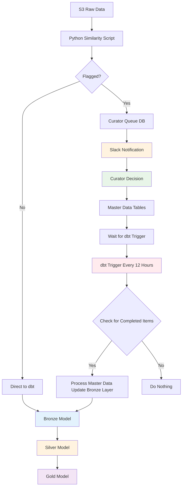

# Site Data Curation

## 1. The Business Challenge
Incoming site records arrive from multiple systems, each with its own naming and partial hierarchies. At scale (millions of rows) we must:
- Identify duplicates (same site, different spellings)
- Detect parent–child relationships (HQ ↔ branch)
- Maintain performance as data volume grows

## 2. Complete Data Pipeline Flow
1. **Data Ingestion** – Raw site data lands in S3 files, triggering Dagster pipeline
2. **Similarity Detection (Python + Polars)** – Analyzes incoming records using multiple algorithms to detect potential duplicates and parent-child relationships
3. **Classification & Routing**:
   - **Flagged for curation** → Routes to curator queue table for manual review
   - **Not flagged** → Continues through normal dbt bronze → silver → gold pipeline
4. **Manual Curation** – Human reviewers process queue items, making merge/link/separate decisions
5. **Re-entry** – Curated decisions update master data and re-enter the pipeline for future processing

## 3. Impact
• > 10× faster end-to-end processing vs. SQL cross-join  
• System gets smarter with use possible ML classification model.

## 4. Curator Decision Options

The `curator_decision` field has **4 main options**:

### `merge_duplicate`
**When**: Same company with minor variations (ACME vs Acme, same address)
**Result**: One record becomes master, other gets merged

### `parent_child`
**When**: Same company but different locations (HQ vs branch)
**Result**: Creates relationship record linking parent and child

### `keep_separate`
**When**: Different companies with similar names
**Result**: Both records remain separate, no action

### `need_more_info`
**When**: Cannot make decision with current information
**Result**: Item stays in queue for later review

## 5. Complete Example: ACME London HQ Merge Process

### Scenario: New "ACME London HQ" vs Existing "ACME London Headquarters"

- **Step 1**: Python detects 87% similarity between new and existing master
- **Step 2**: Flagged for curation, Slack notification sent to curator team
- **Step 3**: Curator decides `merge_duplicate`
- **Step 4**: dbt trigger (every 12 hours) processes decision
- **Step 5**: New record gets merged into existing master
- **Result**: Analytics see one company instead of two

## 6. Key Benefits

- **Scalable**: Python pre-filtering reduces comparisons from trillions to millions
- **Accurate**: Multiple similarity algorithms + human judgment
- **Auditable**: Full traceability of all curation decisions
- **Self-improving**: System learns from curator decisions over time
- **Non-blocking**: Curation doesn't delay normal data pipeline
